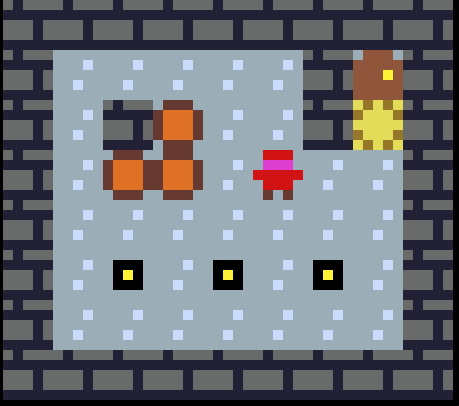
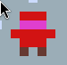

# Heroes-of-Sokoban-WIP
Original:

https://sites.math.washington.edu/~ostroff/puzzles/Heroes_of_Sokoban.html

Basic Sokoban style puzzle game, grid movement, undo mechanic

3 Characters

Warrior - can push multiple objects at once

Thief - can only pull objects

Wizard - teleports and swaps with object he is facing

